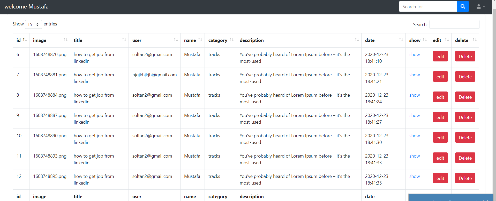
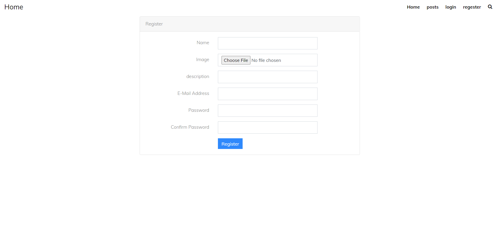

# Multi-User-Blog-php-laravel-8
 

<!-- ABOUT THE PROJECT -->
## About The Project

full functionality multi user article website

features:
* login
* registration
* profile management
* posts management add delete update
* comments
* posts under category
* trends posts 

## Technologies

* laravel
* javascript
* mysql
* html
* css

### template used from

* [colorlib](https://colorlib.com/)

### screenshot

  
  

